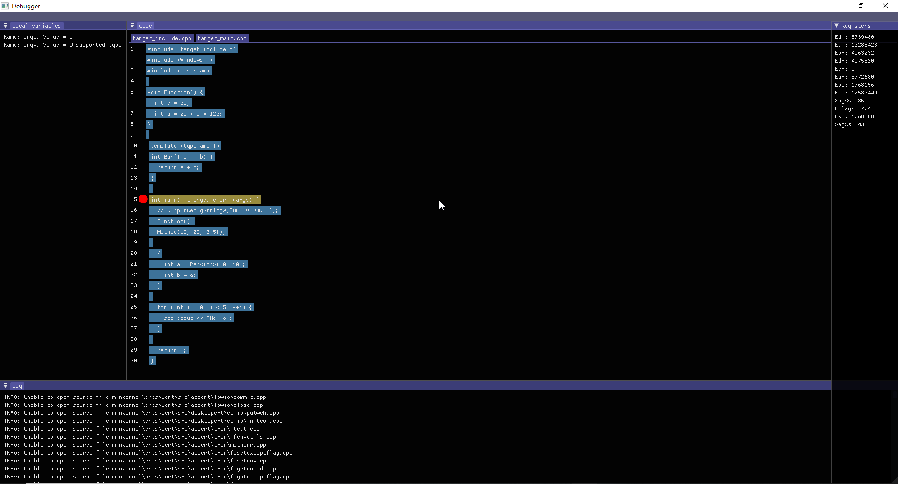

# Debugger
  
# About
Just demo debugger that i wrote  
Issues a lot still need to fix  
# Features
1. Support x86 for now  
2. Doesn't have the ability to look into std::count and stuff  
3. Can F5, F10, F11, Show registers, Show some local variables, Callstack is gathered in code, but do not displayed  
# How to compile
cl main.cpp =)
# Usage
main.exe "executable" "main function name" (WinMain, main, ...)
